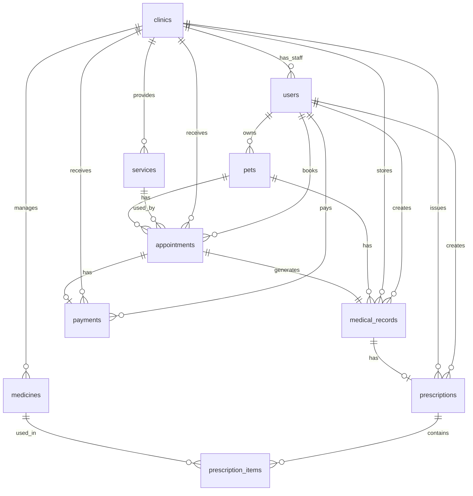

# Pet Care Database Design

Tài liệu này mô tả thiết kế cơ sở dữ liệu của hệ thống quản lý thú cưng/phòng khám thú y. Thiết kế được viết dựa trên các model hiện có trong backend Django.

## 1. Tổng quan

Hệ thống sử dụng các nhóm dữ liệu chính:

- Người dùng và phân quyền: `users`
- Phòng khám và dịch vụ: `clinics`, `services`
- Hồ sơ thú cưng và lịch hẹn: `pets`, `appointments`
- Bệnh án, đơn thuốc và thuốc: `medical_records`, `prescriptions`, `prescription_items`, `medicines`
- Thanh toán và báo cáo: `payments`

Các bảng nghiệp vụ đều kế thừa `TimeStampedModel`, nên có hai trường audit cơ bản:

| Trường | Kiểu dữ liệu | Mô tả |
|---|---|---|
| `created_at` | DateTime | Thời điểm tạo bản ghi |
| `updated_at` | DateTime | Thời điểm cập nhật gần nhất |

Ghi chú:

- Dự án dùng Django Auth, vì vậy ngoài bảng `users` còn có các bảng hệ thống như `auth_group`, `auth_permission`, `users_groups`, `users_user_permissions`, `django_migrations`, v.v.
- `StaffUser` là proxy model của `User`, không tạo bảng riêng.
- Một số dữ liệu nghiệp vụ dùng soft delete thông qua `is_active`, ví dụ `clinics`, `services`, `pets`, `medicines`.

---

## 2. ERD tổng quát



---

## 3. Danh sách bảng

| Bảng | Model | Mô tả |
|---|---|---|
| `users` | `User` | Lưu tài khoản chủ thú cưng, staff phòng khám và admin |
| `clinics` | `Clinic` | Lưu thông tin phòng khám/groomer |
| `services` | `Service` | Danh mục dịch vụ của từng phòng khám |
| `pets` | `Pet` | Hồ sơ thú cưng của pet-owner |
| `appointments` | `Appointment` | Lịch hẹn khám/grooming |
| `medical_records` | `MedicalRecord` | Hồ sơ bệnh án sau khi khám |
| `medicines` | `Medicine` | Kho thuốc theo từng phòng khám |
| `prescriptions` | `Prescription` | Đơn thuốc gắn với bệnh án |
| `prescription_items` | `PrescriptionItem` | Chi tiết thuốc trong đơn |
| `payments` | `Payment` | Thanh toán cho lịch hẹn đã khám xong và đang chờ thanh toán |

---

## 4. Chi tiết bảng

## 4.1. Bảng `users`

Mô tả: lưu thông tin người dùng trong hệ thống. Bảng này mở rộng từ `AbstractUser` của Django.

| Trường | Kiểu dữ liệu | Ràng buộc | Mô tả |
|---|---|---|---|
| `id` | BigAutoField | PK | Khóa chính |
| `username` | CharField(150) | Unique | Tên đăng nhập |
| `password` | CharField | Required | Mật khẩu đã hash |
| `email` | EmailField | Unique | Email |
| `full_name` | CharField(255) | Required | Họ tên |
| `phone` | CharField(20) | Nullable | Số điện thoại |
| `address` | TextField | Nullable | Địa chỉ |
| `role` | CharField(20) | Choices | Vai trò người dùng |
| `clinic_id` | FK -> `clinics.id` | Nullable, SET_NULL | Phòng khám của staff |
| `is_active` | Boolean | Default `true` | Trạng thái tài khoản |
| `is_staff` | Boolean | Django auth | Cho phép vào Django Admin |
| `is_superuser` | Boolean | Django auth | Quyền superuser |
| `last_login` | DateTime | Nullable | Lần đăng nhập gần nhất |
| `date_joined` | DateTime | Auto | Ngày tạo user theo Django |
| `created_at` | DateTime | Auto | Ngày tạo |
| `updated_at` | DateTime | Auto | Ngày cập nhật |

Giá trị `role`:

| Giá trị | Mô tả |
|---|---|
| `PET_OWNER` | Chủ thú cưng |
| `CLINIC_STAFF` | Nhân viên phòng khám |
| `ADMIN` | Quản trị viên |

Quy tắc nghiệp vụ:

- User role `CLINIC_STAFF` bắt buộc phải có `clinic_id`.
- User role `PET_OWNER` và `ADMIN` không được gắn `clinic_id`.
- User role `ADMIN` tự động có `is_staff = true` và `is_superuser = true`.
- User role không phải admin có `is_staff = false` và `is_superuser = false`.

---

## 4.2. Bảng `clinics`

Mô tả: lưu thông tin phòng khám/groomer.

| Trường | Kiểu dữ liệu | Ràng buộc | Mô tả |
|---|---|---|---|
| `id` | BigAutoField | PK | Khóa chính |
| `name` | CharField(255) | Required | Tên phòng khám |
| `address` | CharField(255) | Required | Địa chỉ |
| `phone` | CharField(20) | Blank | Số điện thoại |
| `email` | EmailField | Blank | Email |
| `is_active` | Boolean | Default `true` | Trạng thái hoạt động |
| `created_at` | DateTime | Auto | Ngày tạo |
| `updated_at` | DateTime | Auto | Ngày cập nhật |

Quan hệ:

- Một phòng khám có nhiều staff.
- Một phòng khám có nhiều dịch vụ.
- Một phòng khám có nhiều lịch hẹn, bệnh án, thuốc, đơn thuốc và thanh toán.

Quy tắc nghiệp vụ:

- Khi xóa phòng khám, hệ thống dùng soft delete bằng `is_active = false`.
- Chỉ admin được tạo/cập nhật/xóa mềm phòng khám.

---

## 4.3. Bảng `services`

Mô tả: lưu danh mục dịch vụ mà phòng khám cung cấp.

| Trường | Kiểu dữ liệu | Ràng buộc | Mô tả |
|---|---|---|---|
| `id` | BigAutoField | PK | Khóa chính |
| `clinic_id` | FK -> `clinics.id` | Required, CASCADE | Phòng khám cung cấp dịch vụ |
| `name` | CharField(100) | Required | Tên dịch vụ |
| `service_type` | CharField(20) | Choices | Loại dịch vụ |
| `description` | TextField | Blank | Mô tả |
| `price` | Decimal(10,2) | Required | Giá dịch vụ |
| `duration_minutes` | PositiveInteger | Default `60` | Thời lượng dự kiến |
| `is_active` | Boolean | Default `true` | Trạng thái hoạt động |
| `created_at` | DateTime | Auto | Ngày tạo |
| `updated_at` | DateTime | Auto | Ngày cập nhật |

Giá trị `service_type`:

| Giá trị | Mô tả |
|---|---|
| `EXAM` | Khám bệnh |
| `GROOMING` | Grooming |
| `VACCINE` | Tiêm vaccine |
| `OTHER` | Dịch vụ khác |

Quan hệ:

- Một `Clinic` có nhiều `Service`.
- Một `Service` có thể được dùng trong nhiều `Appointment`.

Quy tắc nghiệp vụ:

- `price` phải lớn hơn 0 khi tạo/cập nhật qua API.
- `duration_minutes` phải lớn hơn 0 khi tạo/cập nhật qua API.
- Khi xóa dịch vụ, hệ thống dùng soft delete bằng `is_active = false`.
- `Appointment.service` dùng `PROTECT`, nên dịch vụ đã phát sinh lịch hẹn không bị xóa cứng.

---

## 4.4. Bảng `pets`

Mô tả: lưu hồ sơ thú cưng của pet-owner.

| Trường | Kiểu dữ liệu | Ràng buộc | Mô tả |
|---|---|---|---|
| `id` | BigAutoField | PK | Khóa chính |
| `owner_id` | FK -> `users.id` | Required, CASCADE | Chủ thú cưng |
| `name` | CharField(100) | Required | Tên thú cưng |
| `species` | CharField(20) | Choices | Loài |
| `breed` | CharField(100) | Blank | Giống |
| `gender` | CharField(10) | Choices | Giới tính |
| `birth_date` | DateField | Nullable | Ngày sinh |
| `weight` | Decimal(5,2) | Nullable | Cân nặng |
| `note` | TextField | Blank | Ghi chú |
| `is_active` | Boolean | Default `true` | Trạng thái hồ sơ |
| `created_at` | DateTime | Auto | Ngày tạo |
| `updated_at` | DateTime | Auto | Ngày cập nhật |

Giá trị `species`:

| Giá trị | Mô tả |
|---|---|
| `DOG` | Chó |
| `CAT` | Mèo |
| `OTHER` | Khác |

Giá trị `gender`:

| Giá trị | Mô tả |
|---|---|
| `MALE` | Đực |
| `FEMALE` | Cái |

Quan hệ:

- Một pet-owner có nhiều thú cưng.
- Một thú cưng có nhiều lịch hẹn.
- Một thú cưng có nhiều bệnh án.

Quy tắc nghiệp vụ:

- Pet-owner chỉ được thao tác trên thú cưng của mình.
- `birth_date` không được lớn hơn ngày hiện tại.
- `weight` phải lớn hơn 0 nếu có nhập.
- Xóa pet là soft delete bằng `is_active = false`.

---

## 4.5. Bảng `appointments`

Mô tả: lưu lịch hẹn khám/grooming giữa chủ thú cưng và phòng khám.

| Trường | Kiểu dữ liệu | Ràng buộc | Mô tả |
|---|---|---|---|
| `id` | BigAutoField | PK | Khóa chính |
| `owner_id` | FK -> `users.id` | Required, CASCADE | Chủ lịch hẹn |
| `pet_id` | FK -> `pets.id` | Required, CASCADE | Thú cưng được đặt lịch |
| `clinic_id` | FK -> `clinics.id` | Required, CASCADE | Phòng khám nhận lịch |
| `service_id` | FK -> `services.id` | Required, PROTECT | Dịch vụ được chọn |
| `appointment_time` | DateTime | Required | Thời gian hẹn |
| `note` | TextField | Blank | Ghi chú của chủ thú cưng |
| `status` | CharField(20) | Choices, Default `PENDING` | Trạng thái lịch hẹn |
| `created_at` | DateTime | Auto | Ngày tạo |
| `updated_at` | DateTime | Auto | Ngày cập nhật |

Giá trị `status`:

| Giá trị | Mô tả |
|---|---|
| `PENDING` | Chờ xác nhận |
| `CONFIRMED` | Đã xác nhận |
| `CHECKED_IN` | Đã check-in |
| `IN_PROGRESS` | Đang khám/chăm sóc |
| `WAITING_PAYMENT` | Đã khám xong, chờ thanh toán |
| `COMPLETED` | Hoàn tất sau khi đã thanh toán |
| `CANCELLED` | Đã hủy |
| `NO_SHOW` | Khách không đến |

Luồng trạng thái chính:

```text
PENDING -> CONFIRMED -> CHECKED_IN -> IN_PROGRESS -> WAITING_PAYMENT -> COMPLETED
                 |
                 -> NO_SHOW

PENDING -> CANCELLED
```

Quan hệ:

- Một `User` role pet-owner có nhiều `Appointment`.
- Một `Pet` có nhiều `Appointment`.
- Một `Clinic` có nhiều `Appointment`.
- Một `Service` có nhiều `Appointment`.
- Một `Appointment` có tối đa một `MedicalRecord`.
- Một `Appointment` có tối đa một `Payment`.

Quy tắc nghiệp vụ:

- Pet-owner chỉ được tạo lịch cho pet của mình.
- Chỉ được đặt lịch với phòng khám và dịch vụ đang hoạt động.
- Service phải thuộc clinic đã chọn.
- `appointment_time` phải lớn hơn thời điểm hiện tại.
- Hệ thống kiểm tra trùng slot theo clinic và `service.duration_minutes`.
- Pet-owner chỉ được cập nhật/hủy lịch ở trạng thái phù hợp.
- Staff chỉ được thao tác lịch hẹn thuộc phòng khám của mình.

---

## 4.6. Bảng `medical_records`

Mô tả: lưu bệnh án được tạo sau quá trình khám/chăm sóc.

| Trường | Kiểu dữ liệu | Ràng buộc | Mô tả |
|---|---|---|---|
| `id` | BigAutoField | PK | Khóa chính |
| `appointment_id` | OneToOne -> `appointments.id` | Required, CASCADE | Lịch hẹn tương ứng |
| `pet_id` | FK -> `pets.id` | Required, CASCADE | Thú cưng |
| `clinic_id` | FK -> `clinics.id` | Required, CASCADE | Phòng khám |
| `staff_id` | FK -> `users.id` | Required, CASCADE | Nhân viên/bác sĩ tạo bệnh án |
| `symptoms` | TextField | Required | Triệu chứng |
| `diagnosis` | TextField | Required | Chẩn đoán |
| `treatment` | TextField | Blank | Hướng điều trị |
| `note` | TextField | Blank | Ghi chú |
| `created_at` | DateTime | Auto | Ngày tạo |
| `updated_at` | DateTime | Auto | Ngày cập nhật |

Quan hệ:

- Một `Appointment` có tối đa một `MedicalRecord`.
- Một `MedicalRecord` có tối đa một `Prescription`.
- Một `Pet` có nhiều `MedicalRecord`.
- Một `Clinic` có nhiều `MedicalRecord`.
- Một staff có thể tạo nhiều `MedicalRecord`.

Quy tắc nghiệp vụ:

- Staff chỉ được tạo/xem/sửa bệnh án thuộc phòng khám của mình.
- Bệnh án phải gắn với lịch hẹn hợp lệ.
- Chủ thú cưng chỉ được xem bệnh án của pet thuộc sở hữu của mình.

---

## 4.7. Bảng `medicines`

Mô tả: lưu thuốc trong kho của từng phòng khám.

| Trường | Kiểu dữ liệu | Ràng buộc | Mô tả |
|---|---|---|---|
| `id` | BigAutoField | PK | Khóa chính |
| `clinic_id` | FK -> `clinics.id` | Required, CASCADE | Phòng khám quản lý thuốc |
| `name` | CharField(150) | Required | Tên thuốc |
| `unit` | CharField(50) | Required | Đơn vị |
| `description` | TextField | Blank | Mô tả |
| `stock_quantity` | PositiveInteger | Default `0` | Số lượng tồn kho |
| `price` | Decimal(10,2) | Default `0` | Giá thuốc |
| `is_active` | Boolean | Default `true` | Trạng thái hoạt động |
| `created_at` | DateTime | Auto | Ngày tạo |
| `updated_at` | DateTime | Auto | Ngày cập nhật |

Ràng buộc:

| Loại | Mô tả |
|---|---|
| Unique Together | `clinic_id`, `name` |
| Ordering | Theo `name` |

Quan hệ:

- Một `Clinic` có nhiều `Medicine`.
- Một `Medicine` có thể xuất hiện trong nhiều `PrescriptionItem`.

Quy tắc nghiệp vụ:

- Staff chỉ thao tác thuốc thuộc phòng khám của mình.
- Không cho tạo trùng tên thuốc trong cùng một phòng khám.
- Khi thêm thuốc vào đơn, tồn kho phải đủ.
- Khi xóa thuốc, hệ thống soft delete bằng `is_active = false`.
- `PrescriptionItem.medicine` dùng `PROTECT`, nên thuốc đã phát sinh đơn không bị xóa cứng.

---

## 4.8. Bảng `prescriptions`

Mô tả: lưu đơn thuốc được tạo từ một bệnh án.

| Trường | Kiểu dữ liệu | Ràng buộc | Mô tả |
|---|---|---|---|
| `id` | BigAutoField | PK | Khóa chính |
| `medical_record_id` | OneToOne -> `medical_records.id` | Required, CASCADE | Bệnh án tương ứng |
| `clinic_id` | FK -> `clinics.id` | Required, CASCADE | Phòng khám |
| `staff_id` | FK -> `users.id` | Required, CASCADE | Staff tạo đơn |
| `note` | TextField | Blank | Ghi chú đơn thuốc |
| `created_at` | DateTime | Auto | Ngày tạo |
| `updated_at` | DateTime | Auto | Ngày cập nhật |

Quan hệ:

- Một `MedicalRecord` có tối đa một `Prescription`.
- Một `Prescription` có nhiều `PrescriptionItem`.
- Một staff có thể tạo nhiều `Prescription`.

Quy tắc nghiệp vụ:

- Staff chỉ được thao tác đơn thuốc thuộc phòng khám của mình.
- Một bệnh án chỉ có một đơn thuốc.
- Chủ thú cưng chỉ được xem đơn thuốc thuộc bệnh án của pet mình sở hữu.

---

## 4.9. Bảng `prescription_items`

Mô tả: lưu chi tiết thuốc trong từng đơn thuốc.

| Trường | Kiểu dữ liệu | Ràng buộc | Mô tả |
|---|---|---|---|
| `id` | BigAutoField | PK | Khóa chính |
| `prescription_id` | FK -> `prescriptions.id` | Required, CASCADE | Đơn thuốc |
| `medicine_id` | FK -> `medicines.id` | Required, PROTECT | Thuốc |
| `quantity` | PositiveInteger | Required | Số lượng |
| `dosage` | CharField(100) | Required | Liều dùng |
| `frequency` | CharField(100) | Required | Tần suất |
| `duration_days` | PositiveInteger | Required | Số ngày dùng |
| `instruction` | TextField | Blank | Hướng dẫn |
| `created_at` | DateTime | Auto | Ngày tạo |
| `updated_at` | DateTime | Auto | Ngày cập nhật |

Ràng buộc:

| Loại | Tên | Mô tả |
|---|---|---|
| Unique Constraint | `unique_prescription_medicine_item` | Một thuốc chỉ xuất hiện một lần trong cùng đơn thuốc |
| Ordering | `id` | Sắp xếp theo thứ tự tạo |

Quan hệ:

- Một `Prescription` có nhiều `PrescriptionItem`.
- Một `Medicine` có nhiều `PrescriptionItem`.

Quy tắc nghiệp vụ:

- `quantity` tối thiểu là 1.
- `duration_days` tối thiểu là 1.
- Khi thêm item, hệ thống trừ tồn kho thuốc.
- Khi cập nhật số lượng, hệ thống điều chỉnh tồn kho theo phần chênh lệch.
- Khi xóa item, hệ thống hoàn lại số lượng thuốc vào kho.

---

## 4.10. Bảng `payments`

Mô tả: lưu thanh toán của pet-owner cho lịch hẹn đã khám xong và đang chờ thanh toán.

| Trường | Kiểu dữ liệu | Ràng buộc | Mô tả |
|---|---|---|---|
| `id` | BigAutoField | PK | Khóa chính |
| `appointment_id` | OneToOne -> `appointments.id` | Required, PROTECT | Lịch hẹn được thanh toán |
| `owner_id` | FK -> `users.id` | Required, PROTECT | Chủ thanh toán |
| `clinic_id` | FK -> `clinics.id` | Required, PROTECT | Phòng khám nhận thanh toán |
| `amount` | Decimal(12,2) | Required | Tổng tiền thanh toán |
| `method` | CharField(20) | Choices, Default `MOCK_ONLINE` | Phương thức thanh toán |
| `status` | CharField(20) | Choices, Default `PENDING` | Trạng thái thanh toán |
| `paid_at` | DateTime | Nullable | Thời điểm thanh toán thành công |
| `transaction_code` | CharField(100) | Unique, Nullable | Mã giao dịch |
| `note` | TextField | Blank | Ghi chú |
| `created_at` | DateTime | Auto | Ngày tạo |
| `updated_at` | DateTime | Auto | Ngày cập nhật |

Giá trị `method`:

| Giá trị | Mô tả |
|---|---|
| `CASH` | Tiền mặt |
| `MOCK_ONLINE` | Thanh toán online giả lập |

Giá trị `status`:

| Giá trị | Mô tả |
|---|---|
| `PENDING` | Đang chờ xử lý |
| `PAID` | Đã thanh toán |
| `FAILED` | Thanh toán thất bại |
| `CANCELLED` | Đã hủy |

Ràng buộc:

| Loại | Tên | Mô tả |
|---|---|---|
| One-to-one | `appointment_id` | Mỗi lịch hẹn chỉ có một payment |
| Unique | `transaction_code` | Mã giao dịch không trùng |
| Check Constraint | `payment_amount_non_negative` | `amount >= 0` |
| Ordering | `-created_at` | Payment mới nhất đứng trước |

Quan hệ:

- Một `Appointment` có tối đa một `Payment`.
- Một pet-owner có nhiều `Payment`.
- Một clinic có nhiều `Payment`.

Quy tắc nghiệp vụ:

- Trong luồng chính, payment được tạo tự động khi staff hoàn tất khám và appointment chuyển sang `WAITING_PAYMENT`.
- Chỉ chủ của lịch hẹn mới được truy cập/xác nhận payment.
- Endpoint tạo payment thủ công chỉ áp dụng cho lịch hẹn `WAITING_PAYMENT`.
- Backend tự tính `amount`, frontend không gửi amount.
- Công thức hiện tại: `service.price + tổng(quantity * medicine.price)` trong đơn thuốc nếu có.
- `MOCK_ONLINE` có thể được xác nhận để chuyển `PENDING` -> `PAID`.
- Khi payment `PAID`, hệ thống ghi `paid_at`, sinh `transaction_code` và chuyển appointment sang `COMPLETED`.

---

## 5. Quan hệ giữa các bảng

| Quan hệ | Loại | Mô tả |
|---|---|---|
| `clinics` -> `users` | 1 - N | Một phòng khám có nhiều staff |
| `users` -> `pets` | 1 - N | Một pet-owner có nhiều thú cưng |
| `clinics` -> `services` | 1 - N | Một phòng khám có nhiều dịch vụ |
| `users` -> `appointments` | 1 - N | Một pet-owner có nhiều lịch hẹn |
| `pets` -> `appointments` | 1 - N | Một thú cưng có nhiều lịch hẹn |
| `clinics` -> `appointments` | 1 - N | Một phòng khám có nhiều lịch hẹn |
| `services` -> `appointments` | 1 - N | Một dịch vụ có nhiều lịch hẹn |
| `appointments` -> `medical_records` | 1 - 0..1 | Một lịch hẹn có tối đa một bệnh án |
| `pets` -> `medical_records` | 1 - N | Một thú cưng có nhiều bệnh án |
| `medical_records` -> `prescriptions` | 1 - 0..1 | Một bệnh án có tối đa một đơn thuốc |
| `prescriptions` -> `prescription_items` | 1 - N | Một đơn thuốc có nhiều chi tiết thuốc |
| `medicines` -> `prescription_items` | 1 - N | Một thuốc có thể nằm trong nhiều đơn |
| `appointments` -> `payments` | 1 - 0..1 | Một lịch hẹn có tối đa một thanh toán |
| `clinics` -> `payments` | 1 - N | Một phòng khám nhận nhiều thanh toán |

---

## 6. Chiến lược xóa dữ liệu

| Bảng | Chiến lược | Lý do |
|---|---|---|
| `clinics` | Soft delete bằng `is_active` | Tránh mất dữ liệu lịch sử |
| `services` | Soft delete bằng `is_active` | Service có thể đã phát sinh lịch hẹn |
| `pets` | Soft delete bằng `is_active` | Pet là trung tâm dữ liệu lịch sử |
| `medicines` | Soft delete bằng `is_active` | Thuốc có thể đã nằm trong đơn |
| `appointments` | Không xóa cứng qua API | Lịch hẹn là dữ liệu nghiệp vụ |
| `medical_records` | Không xóa cứng qua API | Bệnh án cần lưu lịch sử |
| `prescriptions` | Không xóa cứng qua API | Đơn thuốc cần lưu lịch sử |
| `payments` | Không xóa cứng qua API | Thanh toán cần giữ để báo cáo/doanh thu |

---

## 7. Dữ liệu phục vụ báo cáo

Module báo cáo admin không tạo bảng riêng. Các chỉ số được tổng hợp từ bảng nghiệp vụ:

| Chỉ số | Nguồn dữ liệu |
|---|---|
| Tổng doanh thu | `payments.amount` với `status = PAID` |
| Số payment đã thanh toán | `payments` với `status = PAID` |
| Lịch hẹn theo trạng thái | `appointments.status` |
| Doanh thu theo ngày/tháng | `payments.paid_at`, `payments.amount` |
| Doanh thu theo phòng khám | `payments.clinic_id`, `payments.amount` |
| Số pet-owner mới | `users.role = PET_OWNER`, `users.created_at` |
| Số thú cưng mới | `pets.created_at` |
| Số phòng khám | `clinics` |
| Số dịch vụ | `services` |

Lý do không tạo bảng report riêng:

- Dữ liệu báo cáo hiện tại có thể aggregate trực tiếp từ các bảng gốc.
- Tránh dư thừa dữ liệu.
- Phù hợp với quy mô capstone và dễ kiểm thử.

---

## 8. Gợi ý index và tối ưu truy vấn

Hiện tại Django tự tạo index cho khóa chính và khóa ngoại. Nếu dữ liệu lớn hơn, có thể bổ sung index cho các trường thường dùng để lọc/báo cáo:

| Bảng | Trường đề xuất index | Lý do |
|---|---|---|
| `appointments` | `status` | Lọc lịch theo trạng thái |
| `appointments` | `appointment_time` | Tìm lịch theo ngày/giờ |
| `appointments` | `clinic_id`, `appointment_time` | Lịch làm việc của phòng khám |
| `payments` | `status` | Lọc payment đã thanh toán |
| `payments` | `paid_at` | Báo cáo doanh thu theo thời gian |
| `payments` | `clinic_id`, `paid_at` | Báo cáo doanh thu theo phòng khám |
| `pets` | `owner_id`, `is_active` | Danh sách pet của owner |
| `medicines` | `clinic_id`, `is_active` | Kho thuốc theo phòng khám |

Các index này chưa bắt buộc trong giai đoạn hiện tại, vì Django ORM và FK index đã đủ cho dữ liệu demo.

---

## 9. Mapping với use case chính

### 9.1. Chủ thú cưng tạo hồ sơ pet

Các bảng liên quan:

- `users`
- `pets`

Luồng dữ liệu:

```text
users(PET_OWNER) -> pets
```

### 9.2. Chủ thú cưng đặt lịch

Các bảng liên quan:

- `users`
- `pets`
- `clinics`
- `services`
- `appointments`

Luồng dữ liệu:

```text
users -> pets -> appointments <- clinics
appointments -> services
```

### 9.3. Staff tạo bệnh án và kê đơn

Các bảng liên quan:

- `appointments`
- `medical_records`
- `prescriptions`
- `prescription_items`
- `medicines`

Luồng dữ liệu:

```text
appointments -> medical_records -> prescriptions -> prescription_items -> medicines
```

### 9.4. Pet-owner thanh toán

Các bảng liên quan:

- `appointments`
- `services`
- `prescriptions`
- `prescription_items`
- `medicines`
- `payments`

Luồng dữ liệu:

```text
appointments(WAITING_PAYMENT) -> payments(PENDING)
amount = service.price + sum(prescription_items.quantity * medicines.price)
payments(PAID) -> appointments(COMPLETED)
```

### 9.5. Admin xem báo cáo

Các bảng liên quan:

- `payments`
- `appointments`
- `clinics`
- `services`
- `users`
- `pets`

Luồng dữ liệu:

```text
payments(PAID) + appointments + users + pets + clinics + services -> reports
```

---

## 10. Ghi chú triển khai

- Database mặc định trong `settings.py` dùng MySQL thông qua biến môi trường, với tên mặc định `pet_care_db`.
- Test environment dùng cấu hình riêng trong `config/test_settings.py`.
- Các migration chính:
  - `0001_initial.py`: tạo các bảng nghiệp vụ ban đầu.
  - `0002_prescription_item_unique_constraint.py`: thêm unique constraint cho chi tiết đơn thuốc.
  - `0003_payment.py`: thêm bảng thanh toán.
  - `0004_appointment_waiting_payment_status.py`: thêm trạng thái `WAITING_PAYMENT` cho lịch hẹn.
