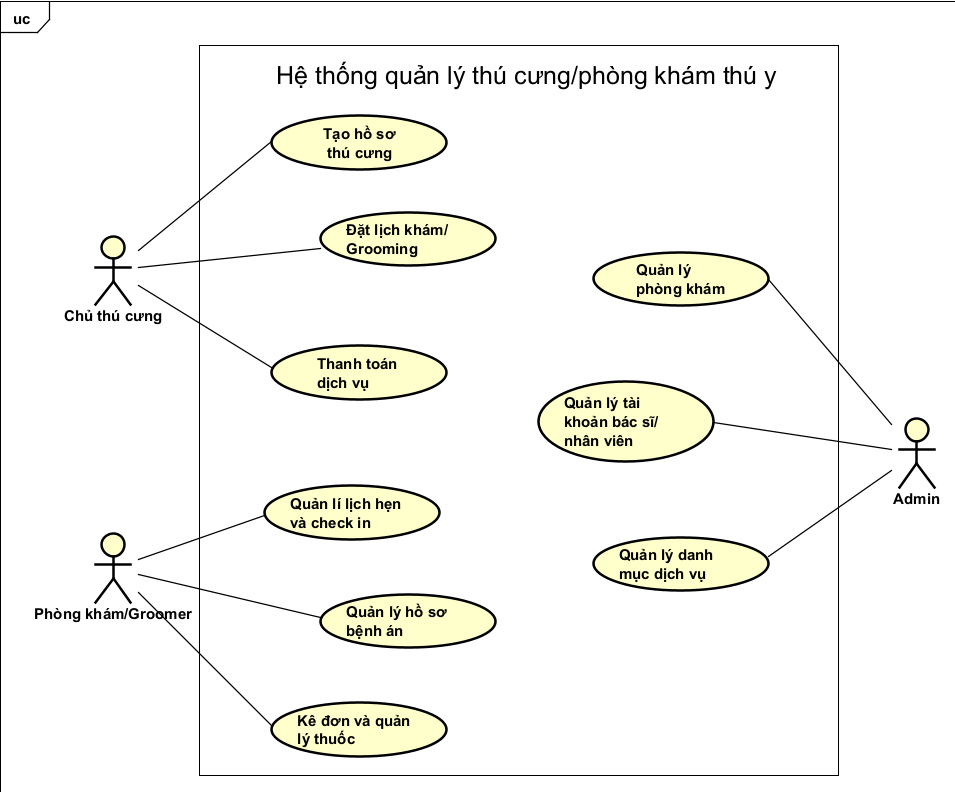

# Hệ thống quản lý thú cưng/phòng khám thú y - Requirements

## 1. Actors
Hệ thống có 3 tác nhân chính:

- Chủ thú cưng
- Phòng khám/Groomer
- Admin

## 2. Functional Requirements

### 2.1 Chủ thú cưng
- Tạo hồ sơ thú cưng (tiêm phòng, bệnh sử)
- Đặt lịch khám/grooming
- Thanh toán dịch vụ

### 2.2 Phòng khám/Groomer
- Quản lý lịch hẹn và check-in
- Quản lý hồ sơ bệnh án
- Kê đơn và quản lý thuốc

### 2.3 Admin
- Quản lý phòng khám (CRUD)
- Quản lý tài khoản bác sĩ/nhân viên
- Quản lý danh mục dịch vụ

## 3. Use Case Diagram

  

## 4. Use Case Specifications

### 4.1 Đặt lịch khám/Grooming

Use case ID|UC01|
|---|---|
|Tên use case|Đặt lịch khám/Grooming|
|Mô tả|Chủ thú cưng đặt lịch khám hoặc grooming cho thú cưng tại phòng khám|
|Actor chính|Chủ thú cưng|
|Actor phụ|Phòng khám/Groomer|
|Pre-Conditions   (Tiền điều kiện)|Chủ thú cưng đã đăng nhập vào hệ thống|
|Post-Conditions <bt> (Hậu điều kiện)|Hệ thống tạo lịch hẹn mới và thông báo cho phòng khám|
|Luồng hoạt động|1. Chủ thú cưng truy cập chức năng **Đặt lịch**.   2. Hệ thống hiển thị danh sách thú cưng của người dùng.   3. Chủ thú cưng chọn thú cưng cần đặt lịch.   4. Hệ thống hiển thị danh sách dịch vụ (khám bệnh, grooming,...).   5. Chủ thú cưng chọn dịch vụ mong muốn.   6. Hệ thống hiển thị danh sách phòng khám và lịch trống.   7. Chủ thú cưng chọn phòng khám và thời gian.   8. Chủ thú cưng xác nhận đặt lịch.   9. Hệ thống lưu thông tin lịch hẹn và gửi thống báo đến phòng khám.|
|Luồng thay thế|A1 - Không có lịch trống   Ở bước 7 nếu phòng khám không có lịch trống, hệ thống hiển thị thông báo và yêu cầu người dùng chọn thời gian khác.|
|Luồng ngoại lệ|E1 - Lỗi hệ thống   Nếu hệ thống không thể tạo lịch hẹn, hiển thị thông báo lỗi và yêu cầu người dùng thử lại.|

### 4.2 Quản lý lịch hẹn và Check-in

|Use case ID|UC02|
|---|---|
|Tên use case|Quản lý lịch hẹn và check-in|
|Mô tả|Phòng khám hoặc groomer quản lý lịch hẹn và thực hiện check-in khi thú cưng đến khám.|
|Actor chính|Phòng khám/Groomer|
|Actor phụ|Chủ thú cưng|
|Pre-Conditions   (Tiền điều kiện)|Đã có lịch hẹn được tạo trên hệ thống|
|Post-Conditions   (Hậu điều kiện)|Hệ thống cập nhật trạng thái thành **Checked-in** hoặc **Completed**|
|Luồng hoạt động|1. Nhân viên phòng khám truy cập chức năng **Quản lý lịch hẹn**.   2. Hệ thống hiện thị danh sách lịch hẹn trong ngày.   3. Nhân viên chọn một lịch hẹn.   4. Hệ thống hiện thị thông tin thú cưng và dịch vụ.   5. Khi thú cưng đến, nhân viên chọn **Check-in**.   6. Hệ thống cập nhật trạng thái lịch hẹn thành **Checked-in**.|
|Luồng thay thế|A1-Khách đến trễ   Ở bước 5 nếu khách đến không đúng lịch hẹn, Nhân viên có thể chọn dời lịch hoặc đánh dấu **No-show**.|
|Luồng ngoại lệ|E1-Lỗi hệ thống   Nếu hệ thống không thể cập nhật trạng thái, hiển thị thông báo lỗi và yêu cầu thử lại.|

### 4.3 Quản lý phòng khám(CRUD)

|Use case ID|UC03|
|---|---|
|Tên use case|Quản lý phòng khám|
|Mô tả|Admin quản lý thông tin phòng khám trong hệ thống|
|Actor chính|Admin|
|Pre-Conditions   (Tiền điều kiện)|Admin đã đăng nhập vào hệ thống|
|Post-Conditions   (Hậu điều kiện)|Thông tin phòng khám được tạo mới, cập nhật hoặc xóa trong hệ thống|
|Luồng hoạt động|1. Admin truy cập chức năng **Quản lý phòng khám**.   2. Hệ thống hiển thị danh sách phòng khám hiện có.   3. Admin chọn môt trong những thao tác **Thêm, Sửa và Xóa** phòng khám.   4. Nếu chọn **Thêm**, Admin nhập thông tin phòng khám.   5. Nếu chọn **Sửa**, Admin cập nhật thông tin phòng khám.   6. Nếu chọn **Xóa**, hệ thống yêu cầu xác nhận.   7. Hệ thống lưu thay đổi và hiển thị thông báo thành công.|
|Luồng thay thế|A1 - Thông tin không hợp lệ   Nếu dữ liệu nhập vào không hợp lệ, hệ thống hiển thị thông báo lỗi và yêu cầu nhập lại.|
|Luồng ngoại lệ|E1 - Lỗi hệ thống   Nếu hệ thống không thể lưu dữ liệu, hiển thị thông báo lỗi và yêu cầu thử lại.|